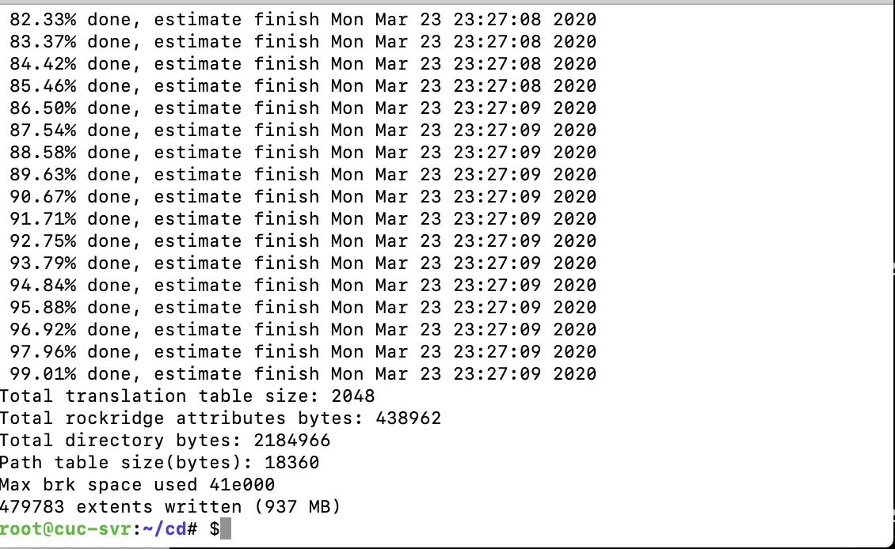

#实验报告

##无人值守安装iso

###软件环境：
Mac os Catalina
Parallels Desktop for Mac
Ubuntu-18.04.4-server-amd64

设置该虚拟机的两块网络网卡：host-only和NAT
启动虚拟机
创建一个用于挂载iso镜像文件的目录
*mkdir loopdir*
挂载iso镜像文件到该目录
*mount -o loop ubuntu-16.04.1-server-amd64.iso loopdir*
####error1

####解决：修改root权限

####error2

####解决：
在loopdir目录下找不到该iso文件，选择使用Mac自带SSH进行远程传输文件到虚拟机上。

连接

####error3
在Mac上尝试连接成功，但仍然无法传输文件

####解决
直到看到了这篇文

原来要退出连接再传文件！

####error4
传输失败

####请教老师后解决
:/loopdir应该是:~/loopdir

确认镜像导入成功

创建一个工作目录用于克隆光盘内容
*mkdir cd*
同步光盘内容到目标工作目录
*rsync -av loopdir/ cd*
卸载iso镜像
*umount loopdir*

下载vim,编辑Ubuntu安装引导界面增加一个新菜单项入口
*vim isolinux/txt.cfg*

添加以下内容到该文件后强制保存退出

*label autoinstall
  menu label ^Auto Install Ubuntu Server
  kernel /install/vmlinuz
  append  file=/cdrom/preseed/ubuntu-server-autoinstall.seed debian-installer/locale=en_US console-setup/layoutcode=us keyboard-configuration/layoutcode=us console-setup/ask_detect=false localechooser/translation/warn-light=true localechooser/translation/warn-severe=true initrd=/install/initrd.gz root=/dev/ram rw quiet*

####error5
传输文件再次失败

####解决
当发现只能传输到loopdir时怀疑是权限问题，于是百度方法打算在Ubuntu中将文件move到preseed下，但由于执行语句错误没有成功，后在老师指导下成功解决。

####error6
无法修改文件

####解决

####error7

无法解决不能复制粘贴的问题，初步怀疑是某个地方打错了。

####解决
通过Mac SSH远程连接虚拟机，在Mac终端操作

